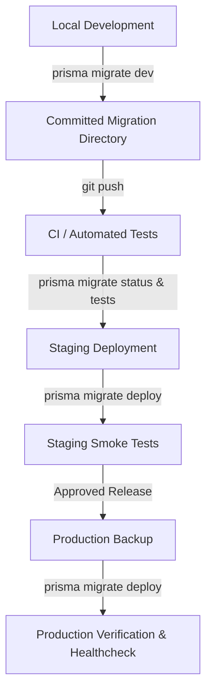

# Standardized Prisma Production Migrations (Issue #33)

## 1. Overview & Policy
To guarantee consistency, predictability, and auditability across all environments (Local, CI, Staging, Production), **all database schema mutations MUST be performed via versioned Prisma migrations.**

### Core Directives:
- **FORBIDDEN IN PRODUCTION**: `prisma db push` and `prisma migrate dev` are strictly prohibited in staging and production environments.
- **MANDATORY IN PRODUCTION**: Production deployments must execute `prisma migrate deploy` (or `npm run migrate:deploy`).
- **VERSIONED HISTORY**: All migration directories in `prisma/migrations` must be committed to source control with sequential 14-digit timestamps.

---

## 2. Standardized Package Scripts

```json
{
  "scripts": {
    "migrate:deploy": "prisma migrate deploy",
    "migrate:status": "prisma migrate status",
    "migrate:resolve": "prisma migrate resolve",
    "db:generate": "prisma generate"
  }
}
```

- `npm run migrate:deploy`: Runs pending committed migrations against the database specified in `DIRECT_URL` / `DATABASE_URL`.
- `npm run migrate:status`: Verifies synchronization state between migration files on disk and the `_prisma_migrations` database ledger.
- `npm run migrate:resolve`: Administrative recovery tool used only during manual disaster recovery or failed migration resolution.
- `npm run db:generate`: Regenerates Prisma Client types matching `schema.prisma`.

---

## 3. Migration Lifecycle & Environment Workflows



### A. Local Development Workflow
1. Modify `prisma/schema.prisma`.
2. Generate migration: `npx prisma migrate dev --name <descriptive_slug>`.
3. Review and refine the generated `migration.sql` (ensure idempotency with `IF NOT EXISTS` / `DROP ... IF EXISTS`).
4. Run integration and regression test suites (`npm test`).
5. Commit the migration folder along with `schema.prisma`.

### B. CI / Testing Workflow
1. Spin up ephemeral PostgreSQL with PostGIS enabled.
2. Run `npm run migrate:deploy` to construct schema from scratch.
3. Execute test suite.

### C. Staging & Production Deployment Workflow
1. **Pre-Deployment Backup**: Execute full PostgreSQL backup (`pg_dump`) prior to applying high-risk or destructive schema changes.
2. **Execute Deployment**: Run `npm run migrate:deploy`.
3. **Verify Migration Status**: Run `npm run migrate:status` to confirm zero unapplied migrations.
4. **Application Boot & Healthcheck**: Verify application boots and `/health` returns HTTP 200 `status: OK`.

---

## 4. Rollback & Forward-Fix Policies
Prisma does not support automatic "down" migrations. In production, rollback and disaster recovery follow these strict guidelines:

1. **Non-Destructive Changes (Additions/Indexes/Constraints)**:
   - Apply a **forward-fix migration** (`npx prisma migrate dev --name revert_xxx`) that safely drops or modifies the constraint without data loss.
2. **Destructive Changes (Column Drops, Table Drops, Structural Migrations)**:
   - Restore database from the pre-deployment `pg_dump` snapshot.
   - Point application instances to the restored database state.
3. **Failed Migration Resolution (`migrate:resolve`)**:
   - If a migration encounters a mid-flight error during deployment, inspect the database, fix the blocking data/DDL, and record the migration as resolved via `npx prisma migrate resolve --applied <migration_name>` or `--rolled-back <migration_name>`.

---

## 5. Verification
- 23 versioned migrations tracked in `prisma/migrations/`.
- Validated with automated test suite [`tests/productionMigrations.test.ts`](../../tests/productionMigrations.test.ts).
- Clean `prisma migrate status` reporting `Database schema is up to date!`.
