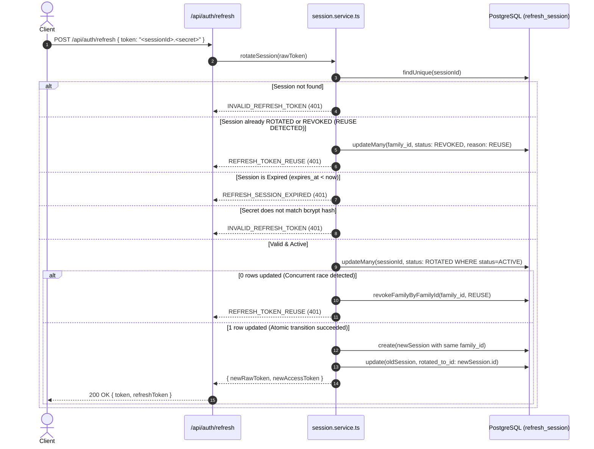

# Issue #10: Server-Side Refresh Sessions & Token Rotation Architecture

**Priority**: P2  
**Category**: Authentication / Session Security  
**Original Audit Findings**: #68–69  
**Status**: REMEDIATED

---

## 1. Executive Summary

Historically, the LabourBaba backend implemented stateless refresh tokens:
1. `POST /api/auth/refresh` merely performed a JWT verification and re-issued a new access token without invalidating the refresh token, creating no audit trail or revocation mechanism.
2. `POST /api/auth/logout` was a stateless no-op returning `{ success: true }` without invalidating the active session.
3. Password-based authentication endpoints (`POST /api/workers/login`, `POST /api/clients/login`) issued only access tokens without any refresh sessions.

This remediation establishes a **canonical, production-grade server-side refresh session lifecycle** backed by PostgreSQL (`refresh_session` table) with:
- **Opaque Token Design**: `<sessionId>.<secret>` format preventing token-forgery or claims-tampering while enabling O(1) database lookups.
- **Cryptographic Storage Security**: Raw refresh tokens and secrets are **NEVER** stored in the database or logged in plaintext. Only bcrypt hashes (`token_hash`) are stored.
- **Atomic Concurrency-Safe Rotation**: Token rotation is gated by conditional atomic queries (`UPDATE refresh_session SET status='ROTATED' WHERE id=:id AND status='ACTIVE'`). Exactly one concurrent request can rotate a token; concurrent racers fail closed and trigger reuse defense.
- **Token Family & Theft Reuse Detection**: When an already-rotated or revoked token is replayed, the entire token family (`family_id`) is instantly revoked (`status='REVOKED'`, `revoked_reason='REUSE'`) to contain token theft.
- **Multi-Device Session Management**: Authenticated users can list their active sessions (`GET /api/auth/sessions`) and selectively revoke specific sessions (`DELETE /api/auth/sessions/:sessionId`) without terminating other devices.
- **Stateful Logout**: `POST /api/auth/logout` invalidates the server-side refresh session, ensuring immediate termination.
- **Seamless Migration & Graceful Fallback**: Existing users with valid legacy JWT refresh tokens are automatically upgraded to stateful server-side sessions upon their next refresh request.

---

## 2. Token Format & Cryptographic Security

### 2.1 Opaque Token Structure

Clients receive an opaque string adhering to the format:
```
<session_id>.<secret>
```
Example:
```
c1b2c3d4-e5f6-4890-a234-56789abcdef0.6812222bf5b587056de2148699806401038ea5f025a23302739c1db9ab75c33c
```

- `session_id` (UUIDv4): Serves as the primary key in PostgreSQL for O(1) indexed lookup.
- `.` (Separator): Defined by `REFRESH_TOKEN_SEPARATOR`.
- `secret`: A 32-byte (256-bit) cryptographically secure random value generated via `crypto.randomBytes(32).toString("hex")` (64 hex characters).

### 2.2 Storage Invariants

1. **No Raw Secrets in DB**: The database records only `bcrypt.hash(secret, 10)` in the `token_hash` column.
2. **Timing Attack Protection**: Verification performs a constant-time `bcrypt.compare(secret, session.token_hash)`.
3. **No Leakage in Logs**: All audit logs log only UUIDs (`sessionId`, `userId`, `familyId`), never raw secrets or tokens.

---

## 3. Database Schema

### `refresh_session` Table

```prisma
model refresh_session {
  id             String    @id @default(dbgenerated("gen_random_uuid()")) @db.Uuid
  user_id        String    @db.Uuid
  user_role      String    @db.VarChar(20)
  token_hash     String    @db.VarChar(255)
  family_id      String    @db.Uuid
  device_id      String?   @db.VarChar(255)
  user_agent     String?   @db.Text
  ip_address     String?   @db.VarChar(50)
  status         String    @default("ACTIVE") @db.VarChar(20)
  created_at     DateTime  @default(now()) @db.Timestamptz(6)
  expires_at     DateTime  @db.Timestamptz(6)
  last_used_at   DateTime? @db.Timestamptz(6)
  rotated_at     DateTime? @db.Timestamptz(6)
  revoked_at     DateTime? @db.Timestamptz(6)
  revoked_reason String?   @db.VarChar(50)

  @@index([user_id, status], map: "idx_refresh_session_user_status")
  @@index([family_id], map: "idx_refresh_session_family")
  @@index([expires_at], map: "idx_refresh_session_expires_at")
  @@index([status, expires_at], map: "idx_refresh_session_status_expires")
  @@map("refresh_session")
}
```

### Session Status Lifecycle

```
[ LOGIN ] ─────────► ACTIVE
                       │
                       │ (rotateSession)
                       ▼
                    ROTATED ───► (Replay Attempt) ───► Family Revoked (REUSE)
                       │
                       │ (logout / admin / expiry)
                       ▼
                    REVOKED
```

---

## 4. Token Rotation & Reuse Detection Workflow



---

## 5. API Endpoints

### 5.1 `POST /api/auth/verify-otp` (Extended)
- **Response**: Returns `{ user, role, token, refreshToken, sessionExpiresAt }`.
- Creates a server-side session for the verified user.

### 5.2 `POST /api/auth/refresh` (Updated)
- **Request Body**: `{ token: "<opaque-refresh-token>" }`
- **Response**: `{ success: true, data: { token: "<new-access-jwt>", refreshToken: "<new-opaque-refresh-token>" } }`
- **Error Codes**:
  - `401 REFRESH_TOKEN_REUSE`: Replay of an already-rotated token detected.
  - `401 REFRESH_SESSION_EXPIRED`: Absolute session TTL elapsed.
  - `401 INVALID_REFRESH_TOKEN`: Tampered or unknown token.

### 5.3 `POST /api/auth/logout` (Updated)
- **Headers**: `Authorization: Bearer <access-token>`
- **Request Body**: `{ refresh_token: "<opaque-refresh-token>" }`
- **Behavior**: Revokes the specific refresh session. Verified against caller `user_id` so callers cannot revoke sessions belonging to other users.

### 5.4 `GET /api/auth/sessions` (New)
- **Headers**: `Authorization: Bearer <access-token>`
- **Behavior**: Lists active sessions for the authenticated user, displaying device, IP, user-agent, creation, and expiration timestamps. Never leaks cryptographic hashes.

### 5.5 `DELETE /api/auth/sessions/:sessionId` (New)
- **Headers**: `Authorization: Bearer <access-token>`
- **Behavior**: Revokes a specific session owned by the authenticated caller.

### 5.6 `POST /api/workers/login` & `POST /api/clients/login` (Updated)
- Password logins now create a stateful server-side refresh session and return `refreshToken`.

---

## 6. Retention & Maintenance

A scheduled cleanup method `sessionService.cleanupExpiredSessions(retentionDaysOverride)` deletes expired/revoked sessions older than the configurable retention window (default 90 days), preserving audit trails while keeping PostgreSQL storage bounded.
